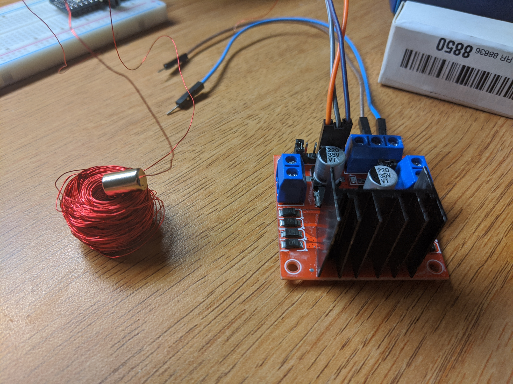
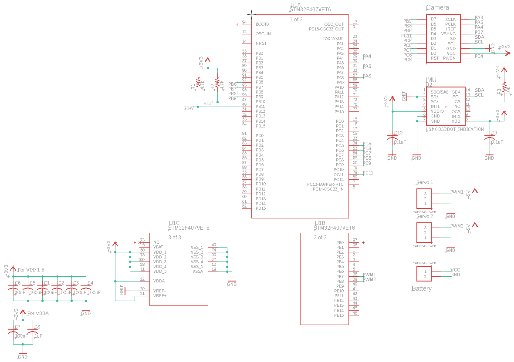
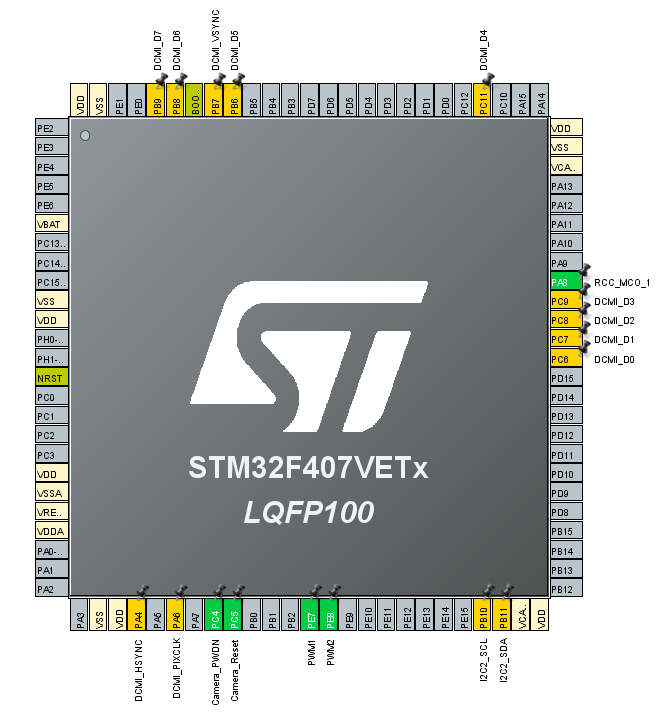

# Dart Electrical Subsystem

## Contributers
* Henry Silva

## Updates

### Week 6 (2/23 - 3/1)

At the start of this week, I ordered the parts for the next magnetic actuator prototype. I bought the [DRV8835 Dual Motor Driver Carrier](https://www.pololu.com/product/2135) from Pololu. For the magnets, I ordered two different sizes, one for the [inner magnet](https://supermagnetman.com/products/cyl0052?_pos=1&_sid=c6e9fa681&_ss=r&variant=11410243843) and [another](https://supermagnetman.com/products/d1001b?_pos=1&_sid=058eb5170&_ss=r&variant=11410255619) for the outside centering magnet. For the inside of the actuator two of the magnets will be placed in between the pivoting rod. Two of the outer magnets will be used to center the inner magnets when the actuator is not powered. They will also be used to provide a counter torque to enable the degree of rotation based on the PWM signal.

### Week 5 (2/17 - 2/23)

Since the pcb would need a motor driver in order to provide enough current to use the magnetic actuator, I started my search for an appropriate motor controller. The first one I found was the [L298](https://www.sparkfun.com/datasheets/Robotics/L298_H_Bridge.pdf) full bridge motor driver. It looked like a good choice for a motor controller because it had 4 outputs for the 4 actuators that would be on the dart. It also has a max current output of up to 4A, which is more than enough to run the actuators. I replaced the 4 servo outputs with the new motor driver on the current dart schematic. I then realized that I would need a buck converter to step down the voltage from 3.7V to 3.3V that would run the logic, ATMEGA, and IMU. I used the [LM3671](http://www.ti.com/product/LM3671) that I have used in past projects. I would also need to boost the 3.7V to 5V to power the motor driver and actuators, but after some research into a converter I decided to look for 3.3V motor drivers because it would be inefficient to convert to 5V just for the motor driver and it would make the circuit smaller is everything ran on 3.3V. I found [this website](https://www.pololu.com/category/11/brushed-dc-motor-drivers) with many motor driver breakout boards for smaller motors. The actuators would not need the higher current output of the previous motor driver, so using a lower current one would not be a problem. The motor drivers on the site had only 2 outputs max, so I would need 2 of the drivers to control all the actuators. I decided on the [DRV8835](https://www.digikey.com/product-detail/en/texas-instruments/DRV8835DSSR/296-30391-1-ND/3188673) because it is small and can output a max current of 1.5A and runs off of 3.3V logic.

Using the guide that I found last week to make a magnetic actuator, I attempted to make one using some neodinium magnets and magnet wire I bought. I used a L298 breakout board as the motor driver. I first make a coil by wrapping around a pencil and turned the wire about 100 times. After hooking up the coil to the motor driver controlled by an arduino nano, I was not able to get a reaction from the magnet. I decided that I did not wrap the coil around enough and made another coil with about 500 turns. The coil was big compared to the magnet, but I was able to vibrate the magnet when I brought it close to the coil. I considered the test a minor success given that I was able to get a reaction out of the magnet.

After the team meeting on friday, another team member and I wanted to try to make a working prototype actuator based on the design from the guide. We 3D printed the actuator which was made up of a cylinder with another piece with pegs that held the magnet within it. The coil was wrapped around the cylinder using a drill to make a tight coil. We tested the actuator by hooking it directly up to a power supply with 1 volt output. At 1 volt, the actuator drew half an amp. The state of the actuator could be controlled by switching the polarity. The actuator was able to switch quickly and with reasonable force.

Goals For Next Week:
* Make another actuator prototype with new design, smaller magnets, and new motor driver
* Keep schematic updated and make changes as needed

### Week 4 (2/9 - 2/16)

I was tasked with getting the position of the dart from the launch point by using data from the accelerometer. After a bit of research, I decided that it would not be a good idea. I explain more about it at the end of my update report from last week. Since I abandoned that objective, I decided that making more progress on the custom pcb would be a good idea. My current schematic uses the stm32f4 as the microcontroller, but I am not confident in making that decision for the rest of the team. I decided to make another schematic using the atmega328p as the micro. I also decided to make a table of all the components on the dart and their power consumption. To find the voltages and draw, I looked at the datasheets for the atmega, pixy2, and the IMU. I was not able to find a data sheet for the servos, but after some research I concluded that the servos would draw about 200 mA between all of them since they would not be under high load. I did not know the power draw of the dart trigger device, but my guess is that it is minimal. Since the dart will only have to be on for less than 30 minutes and only flying for 5 seconds, a small battery will work just fine. A capacitor would require a constant power connection to the dart launcher and would also require an outside contact on the dart.

|Device|Voltage (V)|Power Draw (mA)|Watts|
|----------|------|----------|------|
|atmega328p|	3.3	|1.5|	0.00495|
|pixy2|	5	|140|	0.7|
|lsm6ds3|	3.3	|1	|0.0033|
|Servo (3)|	5|200|	1|
|DTD|	?	|?	|?|

After the team meeting on friday, I got a clearer message of what we want to use onthe dart. It was decided that the atmega328p would be the microcontroller on the dart. The body of the dart was also changed from a lifting body to a more missile shaped projectile. This would change the dimensions of the electronics board, but it will still have enough space to fit everything. Based on the suggestions of one of the faculty advisors, we are going to try and switch from servos to a magnetic actuator. A magnetic actuator is a magnet placed in a coil of wire. Driving current through the wire will cause a magnetic field that will force the magnet to rotate in the direction of the magnetic field. The field can be reversed by switching the polarity of the coil. After doing some searching online, I could not find a vendor for magnetic actuators that would arrive in a reasonable amount of time. I did, however, find multiple [tutorials](https://hackaday.com/2018/04/17/diy-magnetic-actuator-illustrated-and-demonstrated/) on how to make them.

Goals for Next Week:
* Make DIY magnetic actuator and test it
* Start pcb design based on new dart body using atmega and magnetic actuators

### Week 3 (2/2 - 2/9)

My task this week is to research and implement code that will take measurements from an IMU and control servos in order to simulate the dart's response. I first had to figure out how to get data from the IMU I was given. The IMU is the [MPU-9250](https://www.invensense.com/products/motion-tracking/9-axis/mpu-9250/) breakout board. The microcontroller is the arduino nano and the two servos are SG90 micro servos. I first tried to look for stabilization code used for an arduino nano controlled gimbal with servos, but my search came dry with only a few examples that used the IMU I had and none of them were very well documented. I decided to look for example code for the IMU just to get some data out from it and put on the serial monitor. I found sparkfun's example code and library [here](https://github.com/sparkfun/SparkFun_MPU-9250_Breakout_Arduino_Library/blob/master/examples/MPU9250BasicAHRS_I2C/MPU9250BasicAHRS_I2C.ino). I uploaded the example code and after changing the address of the IMU in the code that I found using an [I2C scanner](https://playground.arduino.cc/Main/I2cScanner/), I saw a lot of data output to the console.

The example has a lot of code that I do not need, such as code to display the information to an LCD screen. The program also has options for more advanced output that I also removed. I only wanted the yaw, pitch, and roll values for servo adjustment. I know had to figure out how to control the servos to adjust the pitch and roll. I know that I could just use if statements, but using PID would be better. PID is used to control a system more precisely than just using if statements. I did not know how to use PID with arduino, so I did some searching on Youtube to find an example. This [video](https://www.youtube.com/watch?v=crw0Hcc67RY) does a good job of explaning how to use PID to conrtol an LED with data from a sensor. I now had to apply this to the servos and IMU data. The PID library can be found on [github](https://github.com/br3ttb/Arduino-PID-Library), but can also be added to the arduino IDE through the library manager. I follwed the example from the video and applied it to the IMU yaw data and one of the servos.

After setting up the other two servos, I had to do some PID tuning to get the appropriate response that I wanted. The current input from the IMU gives yaw, pitch, and roll from -90 to 90 degrees. This range of values has to be turned into a range from 0 to 90 or 0 to 180 degrees since the PID library I am using does not work with values above the target value (for example when the target value is 0, the PID computation will output zero for any measurement above zero, so it will only work with negative values). My first attempt to transfer the values was to use the absolute value of the angle and move the servo to the right or left depending on if it was negative or positive. This does not work very well because the PID computation does not know the difference between the positive and negative values. If the yaw were to change from -10 to 10 degrees, the PID loop would think that the value did not change and increase its output. I decided to wait and get some help about how to approach this problem as I did not think I was going in the right direction.

After Friday's team meeting, it was explained to me that control and where the dart is in space are two different problems. I was tasked with first finding the information for where the dart is and then trying to find out how to get it where it needs to be. I know that position can be solved for from acceleration data by taking the double integral, but I did some research to see how possible it was given our hardware. From past experience, I know that getting position information from acceleration data results in a lot of error, my research also supports my previous experience. [This](http://www.chrobotics.com/library/accel-position-velocity) page from a website that sells orientation sensors states that getting position from acceleration data is not accurate enough to be useful with their hardware (their sensors sell for upwards of 200 dollars) and that hardware that is significantly more expensive would be needed in order to get accurate data. I decided that it would be a waste of time to look for solutions for this problem.

### Week 2 (1/26 - 2/2)

This week I was tasked with creating a schematic for the electrical system that we have been decided on thus far. I decided that the stm32f4 I found from my research last week would be used in the schematic. I first consulted the [stm32f4 datasheet](https://www.st.com/content/ccc/resource/technical/document/reference_manual/3d/6d/5a/66/b4/99/40/d4/DM00031020.pdf/files/DM00031020.pdf/jcr:content/translations/en.DM00031020.pdf) to see how it is powered. I could not find what I was looking for, but after some more research I found the [stm32f4 application note](https://www.st.com/content/ccc/resource/technical/document/application_note/76/f9/c8/10/8a/33/4b/f0/DM00115714.pdf/files/DM00115714.pdf/jcr:content/translations/en.DM00115714.pdf) which includes a sample schematic and an in depth description on the hardware needed for power (such as decoupling capacitors) and other functions. 

After placing the appropriate power hardware in the schematic, I then had to search for how to connect the [OV7670](https://www.arducam.com/wp-content/uploads/2019/11/Arducam_ov7670_cmos_camera_module_revc_ds.pdf) camera to the stm32f4. I found a github [repository](https://github.com/iwatake2222/DigitalCamera_STM32) that included the port assignment of the stm32f4 which helped me figure out which pins to connect the camera to. Since the camera uses I2C, pullup resistors were required on the schematic. I used the STM32CubeMX software to keep track of the pin functions and find pins that I could use for PWM and the IMU. I found that PWM just uses a pin with GPIO output that is turned on and off based on a timer, so I assigned two pins for the two servos.

The next part was to find a suitable IMU for acceleration and gyro measurements. I first went to adafruit and sparkfun to find what breakout boards they had for IMUs. I wanted to find an IMU that only had the measurements that I needed and nothing else to keep it simple and cheap. I found the [LSM6DS3](https://www.st.com/content/ccc/resource/technical/document/datasheet/group0/2e/84/27/34/60/8d/49/f2/DM00237513/files/DM00237513.pdf/jcr:content/translations/en.DM00237513.pdf) which provides 3D digital accelerometer and a 3D digital gyroscope. Using sparkfun's eagle files found on their [product page](https://www.sparkfun.com/products/13339), I was able to add the sensor to my schemtic with the appropirate components to power it.

I decided that I would use small jst connectors ([like this one](https://www.digikey.com/product-detail/en/jst-sales-america-inc/SM03B-GHS-TB(LF)(SN)/455-1565-1-ND/807833)) to connect the servos and battery. I then searched for a battery to power the dart while in flight. Since the stm32 and the IMU run off of 3.3v, a battery around that voltage would be preferred, but not manditory since the voltage could be regulated. I saw several 3.7V lithium ion batteries that were under the 4Wh limit set by the competition rules. Since the time of flight will be short (around 5 seconds) I decided that a small battery would be better for the weight limit. I found a selection of lithium ion batteries in the 300 to 500 mAh output range that were under 20 grams such as this [one](https://www.digikey.com/product-detail/en/sparkfun-electronics/PRT-13851/1568-1493-ND/6605199).

Schematic

STM32 Pinout

#### Goals For Next Week

Since the team's meeting about what was done this week and what we are going to prioritize, I have been moved from creating a custom PCB for the time being until we decide on what we want hardware wise on the dart. We also want to focus on getting a prototype out as fast as possible. I am tasked with using an arduino nano with an IMU to drive servos based on the measurements of the imu.

My tasks are as follows:

* Research and find stabilization code that uses input from an IMU in order to keep a plane (or other flying object) level
* Get the IMU and servos working on the arduino nano
* Have a working prototype that could could be put into a prototype dart body and, with some tweaking, be able to be tested

### Week 1 (1/19 - 1/26)

I was tasked with researching the microcontroller and any other electrical components that might be used to control the dart or dart launcher. In the previous meeting, it was decided that the stm32 would be the best choice for the microcontroller. 
Since a camera will be needed for vision targeting, I searched for a stm32 cameras. This lead me to the [DCMI](https://www.st.com/content/ccc/resource/technical/document/application_note/group0/c0/ef/15/38/d1/d6/49/88/DM00373474/files/DM00373474.pdf/jcr:content/translations/en.DM00373474.pdf) (Digital Camera Interface) for stm32. The DCMI allows for the easy connection of a camera to the stm32. The document also lists stm32 models that have DCMI included.

This narrowed down the search for which stm32 to decide on. I looked on digikey for the compatible stm32s and settled on the stm32f4 series because they had the most options and were the cheapest. I decided on the [STM32F407VET6](https://www.digikey.com/product-detail/en/stmicroelectronics/STM32F407VET6/497-12075-ND/2793093) because it seemed to have everything that was required so far for the cheapest price.

In terms of camera modules, the [OV7670](https://www.arducam.com/wp-content/uploads/2019/11/Arducam_ov7670_cmos_camera_module_revc_ds.pdf) seemed to be the most popular one used with the stm32. All image processing functions are fully customizable to customize the camera to what is needed. The resolution of the camera is 640x480, I do not know if that is a good enough resolution given the distance from the target, but if the target gives off enough light it should not be a problem. Although I have found multiple projects that use the camera, I have not found good recent documentation about how to use the camera ([good one but from 2012](https://www.element14.com/community/groups/development-tools/blog/2012/06/11/connecting-an-ov7670-camera-to-the-stm32f4-discovery-board)). More research will be needed if we go along with this choice.

I also did some research into rtos (Real time operating system). From what I understand, it will help the scheduling of tasks so that there is a predictable execution pattern. This also ensures that real time requirements are met (such as a change in the postition of the target relative to the dart, that change being detected, and an appropriate control response that happens in a certain amount of time). I am not sure if a rtos is necessary since the amount of processes running at once will probably not be high, but it also allows programs to pass information to each other and be modular. The information I stated above and more can be found [here](https://www.freertos.org/about-RTOS.html). 

## Abstract

This is an abstract that I do not want to write but to look like that I am writing in class today. I do not want ther to be mad at me. I wrap coil and then put then put magnet in it and then short it on the power supply and see what happens.
