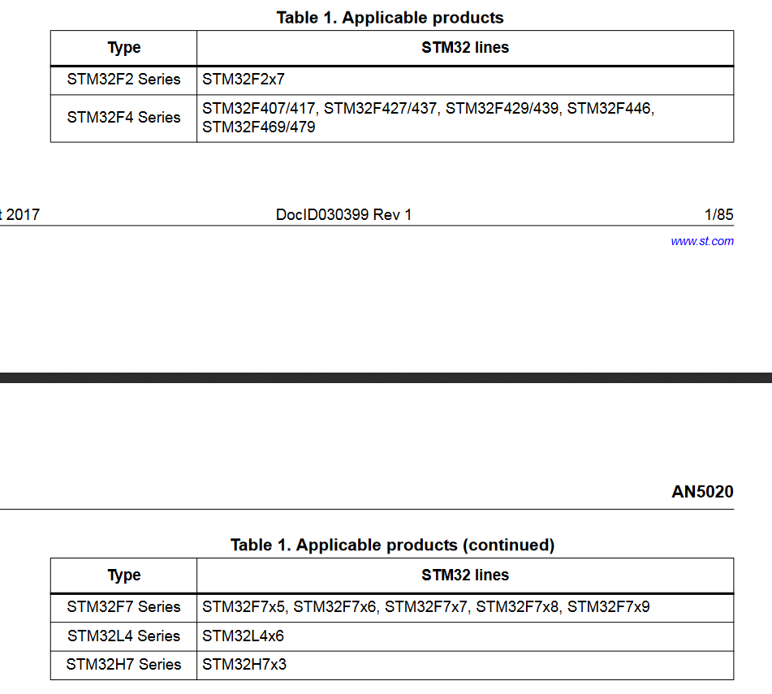

# Dart Electrical Subsystem

## Contributers
* Henry Silva

## Updates

### Week 1 (1/17 - 1/24)

I was tasked with researching the microcontroller and any other electrical components that might be used to control the dart or dart launcher. In the previous meeting, it was decided that the stm32 would be the best choice for the microcontroller. 
Since a camera will be needed for vision targeting, I searched for a stm32 cameras. This lead me to the [DCMI](https://www.st.com/content/ccc/resource/technical/document/application_note/group0/c0/ef/15/38/d1/d6/49/88/DM00373474/files/DM00373474.pdf/jcr:content/translations/en.DM00373474.pdf) (Digital Camera Interface) for stm32. The DCMI allows for the easy connection of a camera to the stm32. The document also lists stm32 models that have DCMI included.

This narrowed down the search for which stm32 to decide on. I looked on digikey for the compatible stm32s and settled on the stm32f4 series because they had the most options and were the cheapest. I decided on the [STM32F407VET6](https://www.digikey.com/product-detail/en/stmicroelectronics/STM32F407VET6/497-12075-ND/2793093) because it seemed to have everything that was required so far for the cheapest price.

In terms of camera modules, the [OV7670](https://www.arducam.com/wp-content/uploads/2019/11/Arducam_ov7670_cmos_camera_module_revc_ds.pdf) seemed to be the most popular one used with the stm32. All image processing functions are fully customizable to customize the camera to what is needed. The resolution of the camera is 640x480, I do not know if that is a good enough resolution given the distance from the target, but if the target gives off enough light it should not be a problem. Although I have found multiple projects that use the camera, I have not found good recent documentation about how to use the camera ([good one but from 2012](https://www.element14.com/community/groups/development-tools/blog/2012/06/11/connecting-an-ov7670-camera-to-the-stm32f4-discovery-board)). More research will be needed if we go along with this choice.

