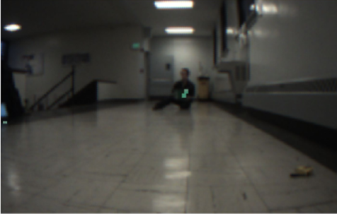

# Software Documentation

## Contributers
* Kurtis Dressel
* Jeff Chen

## Updates

### Week 3 (1/31 - 2/8)

#### Previous Goals:
The primary goal for this past week was to firmly decide what camera to use going forward. Our options were the Pixy2, the original Pixy, and the OV7670. To decide the fps, weight, size, fov, and testing results were taken into consideration. We were planning to test with a green circle image as a substitute for the dart guiding light.

#### Progress:
After researching the factors for each camera, here were the results:

Pixy2: https://docs.pixycam.com/wiki/doku.php?id=wiki:v2:overview
* 60 fps
* Lens field-of-view: 60 degrees horizontal, 40 degrees vertical
* Dimensions:1.5” x 1.65” x 0.6”
* Weight: 10 grams

Pixy1: http://www.cmucam.org/projects/cmucam5
* 50 fps
* Lens field-of-view: 75 degrees horizontal, 47 degrees vertical
* Dimensions: 2.1" x 2.0" x 1.4
* Weight: 27 grams

OV7670: https://www.elecrow.com/ov7670-camerawith-the-al433-fifo-p-589.html
	      https://www.elecfreaks.com/estore/ov7670-camera-module.html
* 30 fps
* View Angle: 25 degrees (presumably horizontal and vertical)
* 12 grams
* Approximately the same size as the Pixy2

From this the Pixy2 would be the best option as it has the highest fps with small size and weight. For the OV7670, I don’t 30 fps will be viable for the in-flight aiming algorithm. The original Pixy does have 15 and 7 more degrees of horizontal and vertical fov respectively, but as fps is more important, the Pixy2 would still make a better choice.

We still needed to test the cameras to see if they were viable. We tested the original Pixy instead of the Pixy2 as Jeff and I did not correct cable to connect the pixy2 directly to a computer on the day we agreed to test the camera, was not able to run an Arduino program with the Pixy2 due to errors, and later could not run the Pixymon v2 software due to crashes. Also, we tested with a 7.75 by 10.5 inch notebook instead of a green circle image as the Pixy2 only partially detected the image (shown on a computer screen). We tested the results at a variety of distances.

Notebook: 

Detected target at 1 meters: 

Detected target at 2 meters: 

Detected target at 5 meters: 

Detected target at 10 meters:

Given that the target was not an actual dart guiding light, the results are not accurate to the results we are looking for. However, I do think we can still conclude that the Pixy can smoothly locate an object at a far away distance. We also tried to jostle the camera around just as the dart will move around in-flight. We noticed that at 10 meters it was the target harder to detect, further testing will need to be done to accurately conclude this.
During the meeting (2/7), we decide that it would be good to continue going forward with using the Pixy2. 

#### Current Goals:
The next main goal is to test the Pixy2 with an actual guiding light and get a signature of the guiding light for later use. During the meeting (2/8), we were able to get the Pixy2 working with the Pixymon software and with Arduino code. With this, we tested the Pixy2 and found that we could make improvements to the current dart guiding light. It was planned that Dansen would improve the dart guiding light so the vision team could test it later this week. During that testing, we plan to do a similar procedure as before while also experimenting with the signature range and brightness variables.

### Week 2 (1/24 - 1/31)

#### Goals
* Receive STM32F407VET6 hardware and beginning working on prototype for the in-flight dart aiming algorithm
* Research what computer vision or machine learning libraries or algorithms to use

Given the meeting we had on Friday (1/24), I wanted to reconsider our options for software to aim the dart.

I talked to Williams, the CV team lead, for advice and he suggested reinforment learning. This would help us tune the different parameters used in launch like the pitch and yaw angle. The caveat of this would be that the dart would have to be precise for the reinforment learning model to work. In other words, if we launch our dart the same way multiple times, the dart would need to roughly hit the same spot each launch. 

Here is some of the possible options for the object detection part of the algorithm:
* CNN: The use Convolution Neural Networks and deep learning to detect objects definetly leads to good results. However, as we are only detecting a green circle in our case instead of say a car, this option would be a bit excessive. Also, we wouldn't be able to run it fast enough on a microcontroller or similar hardware due to the number of computations that need to be done.
* [SVM with HOG](https://towardsdatascience.com/vehicle-detection-using-support-vector-machine-svm-19e073b61d16): for a machine learning approach, I would say this is a good option. I have heard that other robomaster teams use this option for their object detection algorithm. Overall, its not too computationally expensive and the core algorithm is not too complex.
* Find Contours: This would be a non machine learning approach that is used to find any spots in the image that have the same color (e.g. the green light that we are looking for). This approach uses a border following algorithm. Examples of this algorithm would be OpenCV's findContours method or the pixy cam's getBlocks method. Personally I think this would be the best choice given that we are only looking for a green circle, but there could be complications such as blur, other lights, the size of the light being too small, etc that cause this method to not be workable.
* Cascade Classifer: This is one of the algorithms we use on the computer vision team. It was originally used to detect faces and uses features to detect dark and light parts of object in question. It is also color blind. Given these things, I don't think this would be a good option to find a solid green circle.

As a side note, how each option performs is mostly just a good guess based on my knowledge of the algorithm. Its hard to say how fast we will be able to run these algorithms without actually testing them on the hardware that we will end up using.

We may also need to consider what hardware and software we need to run our computer vision algorithms. Like Jeff mentioned in Slack, we may not have enough processing power on the STM32F407VET6 as according to [this site](http://shervinemami.info/embeddedVision.html) the STM32F407 "might handle some extremely basic camera applications". Other options for hardware would include the [Pixy Cam](https://pixycam.com/pixy2/), the [Kendryte K210](https://github.com/kendryte), and [OpenMV](https://openmv.io/).

As for the computer vision libraries, most people say that it is not possible to run OpenCV on a STM32. There was one [source](https://medium.com/@deryugin.denis/how-to-run-opencv-on-stm32-mcu-b581f42b0766) that managed to do it, but it looks like it is too slow. The other software that I found was [OpenVX](https://www.khronos.org/openvx/), which looks to be a vision software aimed at embedded systems. This sounds like a promising solution if we decide to continue using a microcontroller for computer vision. 

### Week 1 (1/17 - 1/24)

#### Goals
* Develop a prototype for the dart aiming algorithm. To start simple, the algorithm can be run on an Arduino. It will use a PixyCam to locate green light. Depending on where the green light is located in the PixyCam image, the algorithm will move two servos in certain ways to simulate the dart aiming towars the target.
* Get started with embedded programming and the STM32 microcontroller by getting a test program to run on a STM32.

For the Arduino dart aiming algorithm, the following needs to be installed
* The Arduino IDE: https://www.arduino.cc/en/main/software
* The Pixy library: https://docs.pixycam.com/wiki/doku.php?id=wiki:v1:Hooking_up_Pixy_to_a_Microcontroller_-28like_an_arduino-29

Currently, the [dart aiming algorithm](pixy_test.ino), arbitrarily moves two servos depending on whether the light found was in the top, bottom, right, or left side of the image. The servos arbitarily move because they are not actually aiming the dart at this stage. Improvements to the algorithm will include excluding certain blocks (grouped pixels of a certain color) depending on their shape and size. This will need to be tested and tweeked in the future. To make the aiming smoother, a PID controller could be added. In fact, there is an example of a PD controller that can be found in the Arduino IDE in File -> Examples -> Pixy -> pantilt.
