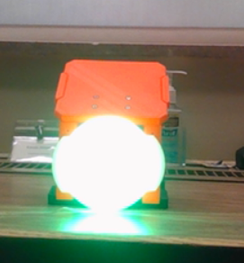
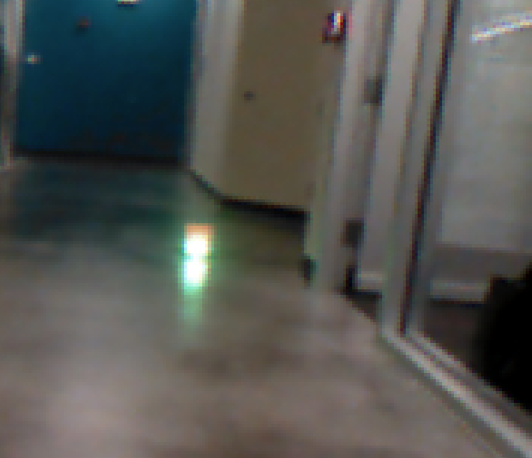

# Software Documentation

## Contributers
* Kurtis Dressel
* Jeff Chen

## Updates

### Week 5 (2/16 - 2/23)

#### Previous Goals:
Last week we had difficulty getting the Pixy2 to detect the dart guiding light. This was primarily due to the overexposure of the light which causes the light to appear white instead of green on the camera image. I would also argue that resolution of the camera at large distances causes the small light to appear like a blurry mismatch of pixels instead of one solid color. So, our goal this week was to experiment and research ways to fix this.

#### Progress:
For the most part, we were not able to fix the current issues. However, we did gain some insight into this problem as well as some possible alternate solutions.
First, we decided to test the light detection by using OpenCV using my laptop camera in order try different options that the Pixy2 software does not support or include. We started by editing the brightness of the image directly and with gamma correction. The brightness of the image was directly lowered by first converting the image to an HSV format and multiplying the Value/Brightness parameters of each pixel by a scalar like 0.03. We followed [this](https://www.pyimagesearch.com/2015/10/05/opencv-gamma-correction/) source on how to implement gamma correction in OpenCV. Here are the results:

An unedited view of the dart guiding light:  

Directly lowering the brightness of the image to 3%:   

Using gamma correction with a gamma of 0.05 to lower the brightness:  

Overall, using gamma correction to lower the brightness of the image causes bright objects including the dart guiding light and other lights we don’t want to detect to become clear in the image and other non-bright objects to disappear. On the other hand, lowering the brightness directly lowers the brightness of the light along with the other non-bright objects. 
In addition to researching the algorithms to detect the dart guiding light, we also researched the hardware. Previously we have not considered the OpenMV camera. However, it looks like this camera shows the same issues of overexposure and low resolution. Here is an example picture from [this](https://www.youtube.com/watch?v=h9VoDcROkxc) source:  

Specifically, the OpenMV camera has a resolution of 640x480. Even more interesting is that the Pixy2 has a resolution of 1296x976. However, according to this source, the original Pixy cannot process that many pixels due to RAM issues and runs at a 320x200 resolution using its color detection algorithm. I am assuming that this also applied to the Pixy2.

Given this and our discussions from meetings, here are some possible solutions to this problem:
* Increase the exposure of the camera that we use to prevent the light being overexposed. Unfortunately, neither the Pixy nor the OpenMV camera support directly changing the exposure of the camera. There are only options to enable or disable auto exposure. Research would need to be done to see how direct exposure editing is possible.
* Use a better resolution to cause the light to be clearer. Since the Pixy2 has a max resolution of 1296x976, it may be possible to develop a border finding or an object detection algorithm that uses less memory to enable the use of more pixels. In this case, only the Pixy2 camera and not its algorithm would be used.
* Use a bandpass filter to only detect green light. If this works as intended, the most of other lights on the field that would’ve been considered by object detection algorithm (since they would be white just like the dart guiding light) would not show up in the image at all.
* Use a guess of where the light is in the image and a white color detection algorithm. If we precompute that the guiding light probably appears in a certain part of the image at a certain time stamp, then we would know during the actual flight that the guiding light is probably the white blob in that image position instead of it being the other white blobs in the image.

#### Current Goals:
As discussed in the last meeting (2/21) we will need to prepare for the midterm presentations and present our findings to the rest of the team. So, my goals for this week would be to develop distance estimation code which given the pixel width of the light returns the real-world distance to the light. A graph with the results of the algorithm needs to be made as well. To prepare for tuning the PID control of the algorithm, the PID control and tuning code will need to be developed. Additionally, I will need to talk to the other team members on how the dart will be controlled in order to develop the code. Another goal would be the research of bandpass filters and how they can support the object detection algorithm.

### Week 4 (2/8 - 2/15)

#### Previous Goals:
During the previous weeks we were not able to get the Pixy2 running due to software crashes and communication errors. So, one of our goals was to get the Pixy2 running so we could test it. The other goal was to test the Pixy2 object detection on the guiding light instead of a notebook. This was to see how the Pixy2 object detection would perform and to experiment with possible parameters to improve the detection.

#### Progress:
During the (2/8) meeting we were able to get the Pixy2 running on both the Pixymon software and through an Arduino nano. In order to get it to work, we needed to install the general Pixy2 firmware as the Pixys that we tested had been using the Lego Pixy2 firmware. For running the Pixy2 through the Arduino nano, the reset button on the nano needed to be repeatedly pressed while code was being uploaded. The other fix that may have helped was using a new Arduino nano with the ATMega328P bootloader instead of the old ATMega328P bootloader. 
In order to test the Pixy2 with the guiding light, I coordinated with Dansen to get the second version of the guiding light. Compared to the first version, the second version has a full set of working LEDs and an added diffuser to diffuse the LED light. This would enable testing to be more accurate and improve the object detection process. 
During the (2/15) meeting, we tested the Pixy2 with the second version of the guiding light. During testing we had more difficulty with the guiding light than we did with the notebook. One of the main issues was that the majority of the pixels in the guiding light are white instead of green. This causes the algorithm to detect other lights, which we do not want to detect. We also noticed that the guiding light quickly became harder to detect at farther distances starting from about 5 meters. 
Here are the results which show these issues:

 
This was the result of the algorithm when the guiding light was close to the Pixy2 and a brightness value of 50 (the default brightness value) was used. In this case, the algorithm also detected the ceiling lamps. 
 
This was the result of the algorithm when the guiding light was about 3 meters from the Pixy2 and a brightness value of 50 (the default brightness value) was used. We were able to detect the light at this distance. 
 
This was the result of the algorithm when the guiding light was about 4.5 meters from the Pixy2 and a brightness value of 50 (the default brightness value) was used. We were not able to detect the light at this distance. 
 
This was the result of the algorithm when the guiding light was close to the Pixy2 and a brightness value of 15 was used. 
 
This was the result of the algorithm when the guiding light was about 5 meters from the Pixy2 and a brightness value of 15 was used. We were able to detect the light normally at this distance. 
 
This was the result of the algorithm when the guiding light was about 10 meters from the Pixy2 and a brightness value of 15 was used. We were able to detect the light about a third of the time at this distance. 

To try to improve the object detection we tried experimenting with a variety of parameters. First, we were not able to test the white balance of the Pixy2 as it does not support changing the white balance directly. When testing the minimum brightness, we noted that it was best to set the minimum brightness as high as possible. This would prevent the algorithm from detecting any non-bright objects. The brightness value seemed to work best at a value of around 20 or 30. Specifically, a brightness value at around 20 or 30 would cause the guiding light to be detected at farther distances than if the brightness was too low (10) or too high (50).

#### Current Goals:
Given that we had difficulty detecting the guiding light with the Pxiy2, our primary goal for this week will be to improve the detection through experimentation and research. During the (2/14) meeting, we talked to Dustin Cruise about software part of the whole project. He recommended that in addition to finding the guiding light position in the camera image, it would also be useful to find the distance from the dart to the target. As we are planning to use a PID feedback control to control the dart, he suggested that it would be best to tune PID values by placing a model of the dart on a gimbal and simulating airflow with something like a leaf blower. With this we could move the fins on the dart to move the dart back and forth. While this happens, we could manually and efficiently tune the PID values using the Ziegler Nichols method. In light of this, our secondary goals would be to develop a distance estimation and a PID controller algorithm.

### Week 3 (1/31 - 2/8)

#### Previous Goals:
The primary goal for this past week was to firmly decide what camera to use going forward. Our options were the Pixy2, the original Pixy, and the OV7670. To decide the fps, weight, size, fov, and testing results were taken into consideration. We were planning to test with a green circle image as a substitute for the dart guiding light.

#### Progress:
After researching the factors for each camera, here were the results:

Pixy2: https://docs.pixycam.com/wiki/doku.php?id=wiki:v2:overview
* 60 fps
* Lens field-of-view: 60 degrees horizontal, 40 degrees vertical
* Dimensions:1.5” x 1.65” x 0.6”
* Weight: 10 grams

Pixy1: http://www.cmucam.org/projects/cmucam5
* 50 fps
* Lens field-of-view: 75 degrees horizontal, 47 degrees vertical
* Dimensions: 2.1" x 2.0" x 1.4
* Weight: 27 grams

OV7670: https://www.elecrow.com/ov7670-camerawith-the-al433-fifo-p-589.html
	      https://www.elecfreaks.com/estore/ov7670-camera-module.html
* 30 fps
* View Angle: 25 degrees (presumably horizontal and vertical)
* 12 grams
* Approximately the same size as the Pixy2

From this the Pixy2 would be the best option as it has the highest fps with small size and weight. For the OV7670, I don’t 30 fps will be viable for the in-flight aiming algorithm. The original Pixy does have 15 and 7 more degrees of horizontal and vertical fov respectively, but as fps is more important, the Pixy2 would still make a better choice.

We still needed to test the cameras to see if they were viable. We tested the original Pixy instead of the Pixy2 as Jeff and I did not correct cable to connect the pixy2 directly to a computer on the day we agreed to test the camera, was not able to run an Arduino program with the Pixy2 due to errors, and later could not run the Pixymon v2 software due to crashes. Also, we tested with a 7.75 by 10.5 inch notebook instead of a green circle image as the Pixy2 only partially detected the image (shown on a computer screen). We tested the results at a variety of distances.

Notebook: 

Detected target at 1 meters: 

Detected target at 2 meters: 

Detected target at 5 meters: 

Detected target at 10 meters:

Given that the target was not an actual dart guiding light, the results are not accurate to the results we are looking for. However, I do think we can still conclude that the Pixy can smoothly locate an object at a far away distance. We also tried to jostle the camera around just as the dart will move around in-flight. We noticed that at 10 meters it was the target harder to detect, further testing will need to be done to accurately conclude this.
During the meeting (2/7), we decide that it would be good to continue going forward with using the Pixy2. 

#### Current Goals:
The next main goal is to test the Pixy2 with an actual guiding light and get a signature of the guiding light for later use. During the meeting (2/8), we were able to get the Pixy2 working with the Pixymon software and with Arduino code. With this, we tested the Pixy2 and found that we could make improvements to the current dart guiding light. It was planned that Dansen would improve the dart guiding light so the vision team could test it later this week. During that testing, we plan to do a similar procedure as before while also experimenting with the signature range and brightness variables.

### Week 2 (1/24 - 1/31)

#### Goals
* Receive STM32F407VET6 hardware and beginning working on prototype for the in-flight dart aiming algorithm
* Research what computer vision or machine learning libraries or algorithms to use

Given the meeting we had on Friday (1/24), I wanted to reconsider our options for software to aim the dart.

I talked to Williams, the CV team lead, for advice and he suggested reinforment learning. This would help us tune the different parameters used in launch like the pitch and yaw angle. The caveat of this would be that the dart would have to be precise for the reinforment learning model to work. In other words, if we launch our dart the same way multiple times, the dart would need to roughly hit the same spot each launch. 

Here is some of the possible options for the object detection part of the algorithm:
* CNN: The use Convolution Neural Networks and deep learning to detect objects definetly leads to good results. However, as we are only detecting a green circle in our case instead of say a car, this option would be a bit excessive. Also, we wouldn't be able to run it fast enough on a microcontroller or similar hardware due to the number of computations that need to be done.
* [SVM with HOG](https://towardsdatascience.com/vehicle-detection-using-support-vector-machine-svm-19e073b61d16): for a machine learning approach, I would say this is a good option. I have heard that other robomaster teams use this option for their object detection algorithm. Overall, its not too computationally expensive and the core algorithm is not too complex.
* Find Contours: This would be a non machine learning approach that is used to find any spots in the image that have the same color (e.g. the green light that we are looking for). This approach uses a border following algorithm. Examples of this algorithm would be OpenCV's findContours method or the pixy cam's getBlocks method. Personally I think this would be the best choice given that we are only looking for a green circle, but there could be complications such as blur, other lights, the size of the light being too small, etc that cause this method to not be workable.
* Cascade Classifer: This is one of the algorithms we use on the computer vision team. It was originally used to detect faces and uses features to detect dark and light parts of object in question. It is also color blind. Given these things, I don't think this would be a good option to find a solid green circle.

As a side note, how each option performs is mostly just a good guess based on my knowledge of the algorithm. Its hard to say how fast we will be able to run these algorithms without actually testing them on the hardware that we will end up using.

We may also need to consider what hardware and software we need to run our computer vision algorithms. Like Jeff mentioned in Slack, we may not have enough processing power on the STM32F407VET6 as according to [this site](http://shervinemami.info/embeddedVision.html) the STM32F407 "might handle some extremely basic camera applications". Other options for hardware would include the [Pixy Cam](https://pixycam.com/pixy2/), the [Kendryte K210](https://github.com/kendryte), and [OpenMV](https://openmv.io/).

As for the computer vision libraries, most people say that it is not possible to run OpenCV on a STM32. There was one [source](https://medium.com/@deryugin.denis/how-to-run-opencv-on-stm32-mcu-b581f42b0766) that managed to do it, but it looks like it is too slow. The other software that I found was [OpenVX](https://www.khronos.org/openvx/), which looks to be a vision software aimed at embedded systems. This sounds like a promising solution if we decide to continue using a microcontroller for computer vision. 

### Week 1 (1/17 - 1/24)

#### Goals
* Develop a prototype for the dart aiming algorithm. To start simple, the algorithm can be run on an Arduino. It will use a PixyCam to locate green light. Depending on where the green light is located in the PixyCam image, the algorithm will move two servos in certain ways to simulate the dart aiming towars the target.
* Get started with embedded programming and the STM32 microcontroller by getting a test program to run on a STM32.

For the Arduino dart aiming algorithm, the following needs to be installed
* The Arduino IDE: https://www.arduino.cc/en/main/software
* The Pixy library: https://docs.pixycam.com/wiki/doku.php?id=wiki:v1:Hooking_up_Pixy_to_a_Microcontroller_-28like_an_arduino-29

Currently, the [dart aiming algorithm](pixy_test.ino), arbitrarily moves two servos depending on whether the light found was in the top, bottom, right, or left side of the image. The servos arbitarily move because they are not actually aiming the dart at this stage. Improvements to the algorithm will include excluding certain blocks (grouped pixels of a certain color) depending on their shape and size. This will need to be tested and tweeked in the future. To make the aiming smoother, a PID controller could be added. In fact, there is an example of a PD controller that can be found in the Arduino IDE in File -> Examples -> Pixy -> pantilt.
